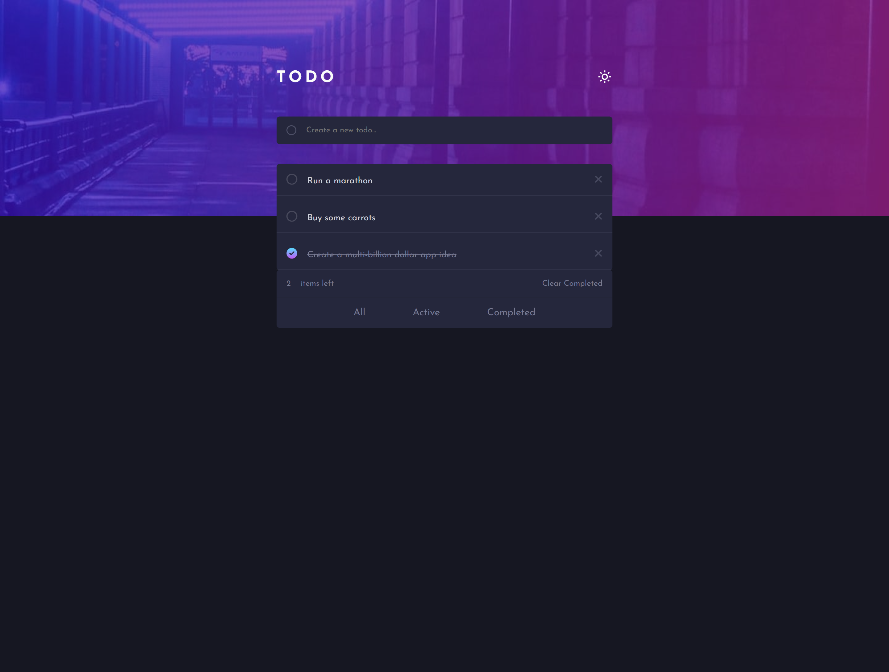

# Frontend Mentor - Todo app solution

This is a solution to the [Todo app challenge on Frontend Mentor](https://www.frontendmentor.io/challenges/todo-app-Su1_KokOW). This project was made with HTML, SCSS, Javascript, and Vite as a build tool. The main focus of this project was being able to create a fully functioning ToDo List project which allows users to save to local storage.

## Table of contents

- [Overview](#overview)
  - [The challenge](#the-challenge)
  - [Screenshot](#screenshot)
- [My process](#my-process)
  - [Built with](#built-with)
  - [What I learned](#what-i-learned)
- [Author](#author) -[Contact](#contact)
- [Acknowledgments](#acknowledgments)

## Overview

### The challenge

Users should be able to:

- View the optimal layout for the app depending on their device's screen size
- See hover states for all interactive elements on the page
- Add new todos to the list
- Mark todos as complete
- Delete todos from the list
- Filter by all/active/complete todos
- Clear all completed todos
- Toggle light and dark mode

### Screenshot

## My process

### Built with

- Semantic HTML5 markup
- SCSS custom properties
- Flexbox
- CSS Grid
- Mobile-first workflow
- Vanilla Javascript

### What I learned

In this project, I learned how to use SCSS variables in conjunction with the map-get function to implement a light mode and dark mode in the application.

To switch between light mode and dark mode, I simply changed the value of the $current-theme variable to point to the light mode or dark mode map. The rest of the CSS would automatically update to use the colors from the new theme map thanks to the map-get function.

That was a great learning experience.

## Author

- Frontend Mentor - [dev-jlagunas](https://www.frontendmentor.io/profile/dev-jlagunas)

## Contact

For any questions or concerns, please contact Juan Lagunas at dev.jlagunas@gmail.com

## Acknowledgments

Thank you to Frontend Mentor for providing us with these challenges. The challenges had helped me progress so much so I am extremely grateful.
